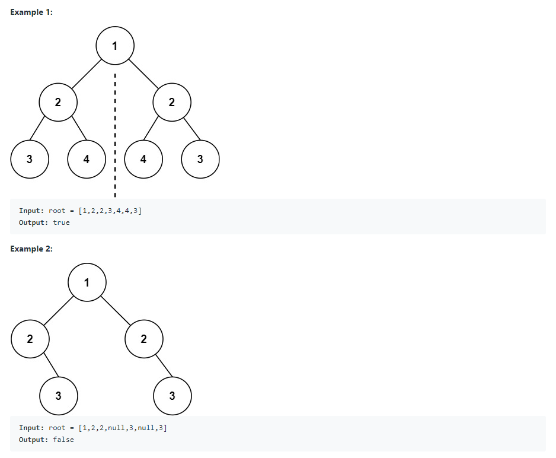

# My jdk8 sample problems & solutions

## MySampleClass

### Given Problem
  Given list of objects  : [{emp1,10,2000}, {emp2,20,6000}, {emp3,20,5000}, {emp4,10,3000}]. Return the sum of salaries grouped by deptId using stream function.
### Output
  Employees list : [{emp1,10,2000}, {emp2,20,6000}, {emp3,20,5000}, {emp4,10,3000}]
  Salary sum for all depId : 16000
  Salary sum for depId 10 : 5000
  Salary sum for depId 20 : 11000

## SinglyLinkedList

### Given Problem
  Given singly linked list with values 1 2 3 4, Return the nth last element.
### Output
  1	2	3	4	
  Length is 4
  3rd Last node is 2

## BinaryTree
  https://leetcode.com/problems/symmetric-tree/
### Given Problem
  Given the root of a binary tree, check whether it is a mirror of itself (i.e., symmetric around its center).
  
